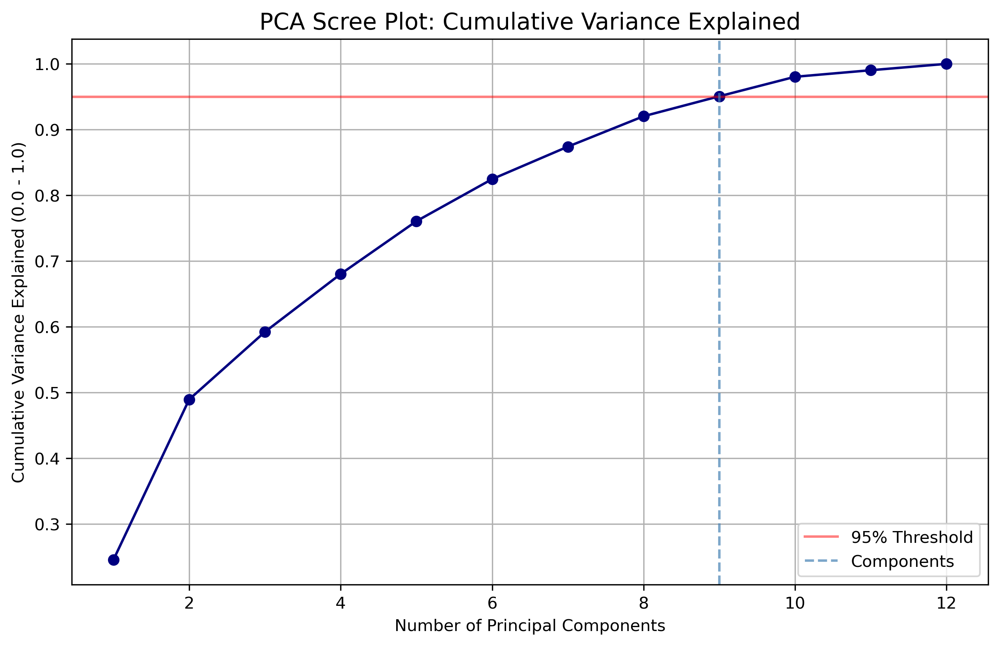
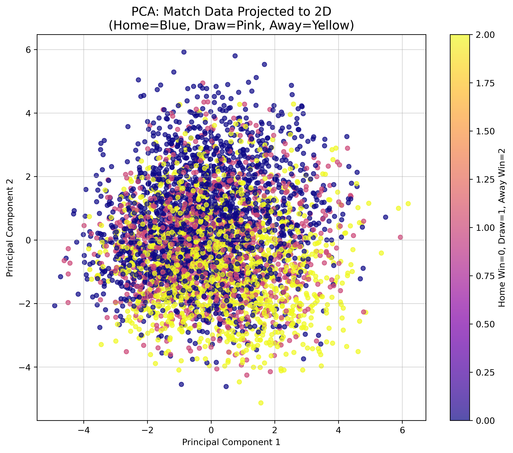
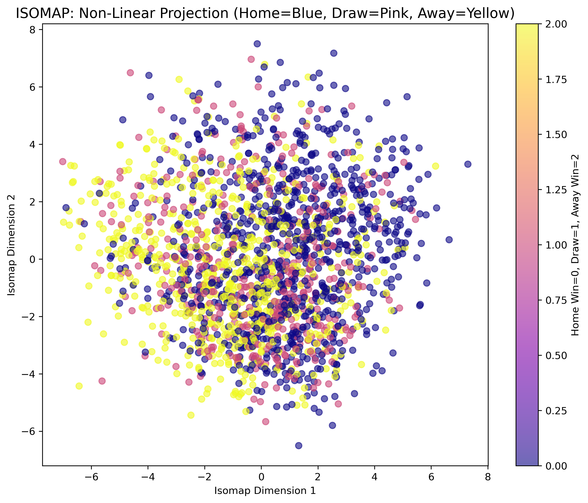
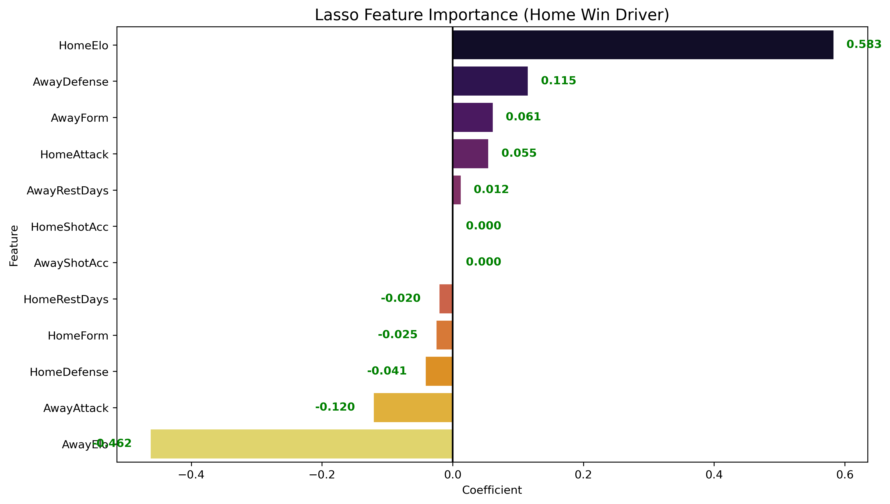
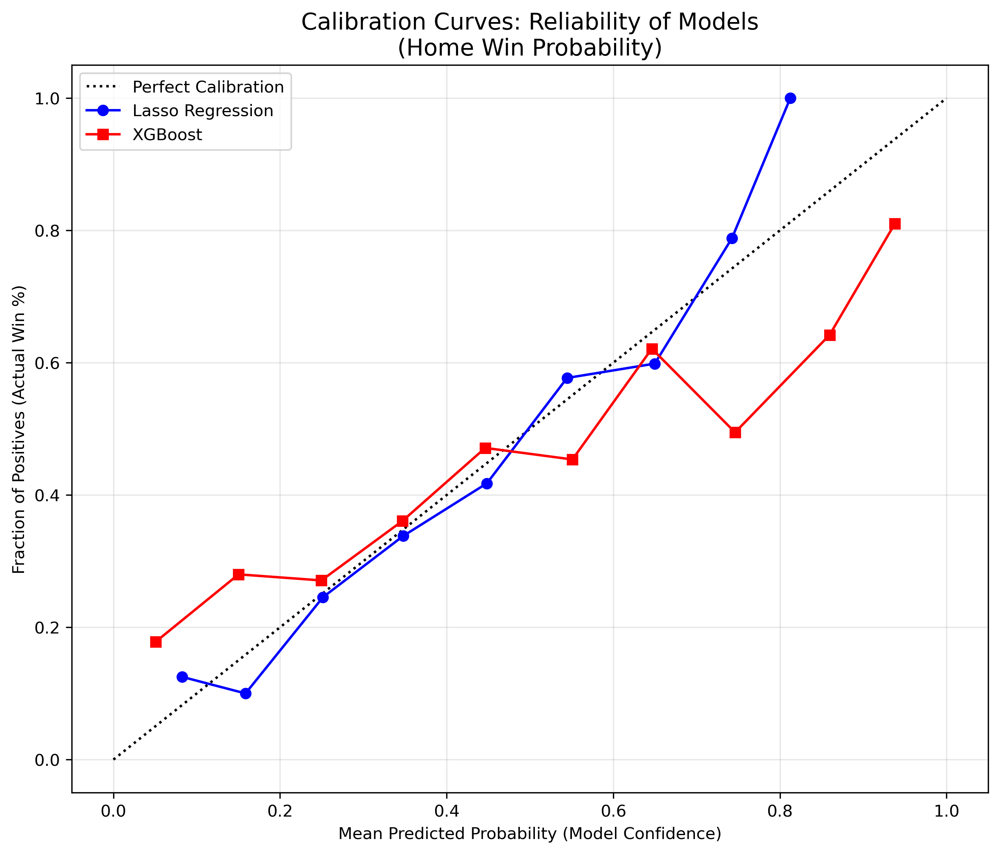

# Premier League Match Prediction


A machine learning project that predicts English Premier League match outcomes using Elo ratings, rolling form metrics, and shot accuracy — evaluated against a Bet365 betting market benchmark using time-series cross-validation and McNemar's statistical tests.

> Developed as a final project for Georgia Tech ISYE 6740: Computational Data Analysis.

---

## Table of Contents

1. [Overview](#overview)
2. [Features](#features)
3. [Repository Structure](#repository-structure)
4. [Prerequisites](#prerequisites)
5. [Installation](#installation)
6. [Dataset](#dataset)
7. [Quick Start](#quick-start)
8. [Usage](#usage)
9. [Modeling Approach](#modeling-approach)
10. [Results](#results)
11. [Troubleshooting](#troubleshooting)
12. [Roadmap](#roadmap)
13. [Contributing](#contributing)
14. [License](#license)
15. [Acknowledgments](#acknowledgments)

---

## Overview

Predicting football match outcomes is a three-class classification problem (home win, draw, away win) where the draw class is chronically underrepresented and in-game statistics cannot be used as predictors without introducing data leakage. This project addresses both challenges directly.

Rather than relying on raw match statistics available only after the final whistle, all features are engineered exclusively from information available before kick-off: pre-match Elo ratings, rolling five-match form windows, rest day counts, and rolling shot accuracy. Models are validated using time-series-aware cross-validation to respect the temporal ordering of matches, and their final performance is benchmarked against implied probabilities derived from Bet365 closing odds — a stringent real-world baseline.

Statistical significance of performance differences is assessed using McNemar's test.

---

## Features

- Implements a full Elo rating system with home advantage offset (+100 points), updating ratings after every match in chronological order.
- Engineers rolling five-match form features per team including average points, goals scored, goals conceded, and shot accuracy, with `.shift(1)` applied to prevent data leakage.
- Computes rest day counts (days since each team's previous fixture) as a fatigue proxy.
- Performs PCA dimensionality reduction with a 95% variance retention threshold and visualizes the data in 2D.
- Generates an ISOMAP non-linear manifold projection on a 2,000-match sample for structural comparison with PCA.
- Trains five classifiers across two feature sets (raw and PCA-reduced) using five-fold `TimeSeriesSplit` cross-validation.
- Benchmarks all models against Bet365 implied probabilities (normalized to sum to 1.0).
- Plots Lasso and XGBoost probability calibration curves to assess reliability of predicted probabilities.
- Runs McNemar's test across four pairwise model comparisons to determine statistical significance of accuracy differences.

---

## Repository Structure

```
premier-league-match-prediction/
├── images/                             # Plot outputs referenced in this README
│   ├── pca_scree_plot.png
│   ├── pca_match_data_proj_2d.png
│   ├── isomap_nonlin_proj.png
│   ├── lasso_feat_importance.png
│   └── calibration_curves.png
├── PL_matches/                         # Raw Premier League season CSV files
│   └── PL-YYYY-YYYY.csv               # One file per season (e.g., PL-2022-2023.csv)
├── PL_Pred.ipynb                       # Main analysis and modeling notebook
├── ISYE6740_Project_Proposal.pdf       # Initial project proposal
├── Project Documentation.pdf          # Final written report
├── sanwar9_FinalProj_Team223.zip       # Full course submission archive (Team 223)
└── .vscode/                            # Editor settings (not required to run the project)
```

---

## Prerequisites

- Python 3.9 or higher
- `pip` (Python package manager)
- Jupyter Notebook or JupyterLab

The following Python libraries are required:

| Library | Purpose |
|---|---|
| `pandas` | Data loading, reshaping, and feature engineering |
| `numpy` | Numerical operations |
| `scikit-learn` | PCA, ISOMAP, model training, cross-validation, and evaluation |
| `xgboost` | Gradient boosting classifier |
| `statsmodels` | McNemar's test |
| `matplotlib` | Plotting and visualization |
| `seaborn` | Statistical visualizations |

---

## Installation

**1. Clone the repository:**

```bash
git clone https://github.com/shehzanwar/premier-league-match-prediction.git
cd premier-league-match-prediction
```

**2. (Recommended) Create and activate a virtual environment:**

```bash
python -m venv venv

# On macOS/Linux:
source venv/bin/activate

# On Windows:
venv\Scripts\activate
```

**3. Install required dependencies:**

```bash
pip install pandas numpy scikit-learn xgboost statsmodels matplotlib seaborn jupyter
```

---

## Dataset

This project uses historical English Premier League match records from [football-data.co.uk](https://www.football-data.co.uk/englandm.php). Season files must be named in the format `PL-YYYY-YYYY.csv` and placed in the `PL_matches/` directory.

The loader selects and uses the following columns from each file:

| Column | Description |
|---|---|
| `Date` | Match date (parsed as `dayfirst=True`) |
| `HomeTeam` / `AwayTeam` | Team names |
| `FTHG` / `FTAG` | Full-time goals (home / away) |
| `FTR` | Full-time result: `H` (home win), `D` (draw), `A` (away win) |
| `HS` / `AS` | Total shots (home / away) |
| `HST` / `AST` | Shots on target |
| `HF` / `AF` | Fouls committed |
| `HC` / `AC` | Corners |
| `HY` / `AY` | Yellow cards |
| `HR` / `AR` | Red cards |
| `B365H` / `B365D` / `B365A` | Bet365 closing odds (home / draw / away) |

Files missing any of the required columns are skipped with a logged warning. The loader handles encoding issues via `encoding='unicode_escape'`.

> Download season files from [football-data.co.uk/englandm.php](https://www.football-data.co.uk/englandm.php). Place all `.csv` files in `PL_matches/` before running the notebook.

---

## Quick Start

Launch the notebook and run all cells sequentially:

```bash
jupyter notebook PL_Pred.ipynb
```

Cells must be run in order from top to bottom. The notebook is self-contained and produces all outputs inline including summary tables, visualizations, cross-validation results, and McNemar's test output.

---

## Usage

The full pipeline in `PL_Pred.ipynb` is organized into the following sections:

### 1. Data Loading and Cleaning

All `PL-*.csv` files in `PL_matches/` are loaded, filtered to required columns, concatenated, and sorted chronologically by match date.

### 2. Feature Engineering

**Elo Ratings** — A standard Elo system is implemented and applied match-by-match in chronological order. All teams start at 1,500. The home team receives a +100 point advantage in the expected-score calculation. Ratings update after every match using K=20.

**Rolling Form (5-match window)** — A unified home/away team-match view is constructed and `.shift(1)` is applied before computing rolling averages to prevent any current-match information from leaking into the features.

| Feature | Description |
|---|---|
| `HomeElo` / `AwayElo` | Pre-match Elo rating |
| `HomeForm` / `AwayForm` | Rolling 5-match average points earned |
| `HomeAttack` / `AwayAttack` | Rolling 5-match average goals scored |
| `HomeDefense` / `AwayDefense` | Rolling 5-match average goals conceded |
| `HomeShotAcc` / `AwayShotAcc` | Rolling 5-match shot accuracy (shots on target / shots) |
| `HomeRestDays` / `AwayRestDays` | Days elapsed since each team's previous match |

**Target variable encoding:**

| Result | Label |
|---|---|
| Home win (`H`) | `0` |
| Draw (`D`) | `1` |
| Away win (`A`) | `2` |

### 3. Dimensionality Reduction and Visualization

- **PCA scree plot** — Identifies the number of components needed to retain 95% of variance (`n_components_95 = 9`).
- **PCA 2D projection** — Plots all matches projected onto the first two principal components, colored by result class.
- **ISOMAP 2D projection** — Applies non-linear manifold learning (`n_neighbors=20`) on a random 2,000-match subsample for structural comparison with the linear PCA projection.

### 4. Cross-Validated Model Training

Each model is trained and evaluated under two feature conditions:

- **Raw** — All 12 engineered features, scaled with `StandardScaler` inside the pipeline.
- **PCA** — Same features reduced to 9 principal components inside the pipeline.

Validation uses `TimeSeriesSplit(n_splits=5)` to ensure no future match data is used during training at any fold. Scaling and PCA fitting occur inside each fold to prevent leakage.

Metrics averaged across all five folds:

- Accuracy
- Macro F1-score (macro averaging to give equal weight to the underrepresented Draw class)
- Log loss

### 5. Feature Importance

Lasso Logistic Regression coefficients for the Home Win class are extracted and plotted as a horizontal bar chart to identify which features drive home win predictions.

### 6. Probability Calibration

Calibration curves for Lasso and XGBoost are plotted for the Home Win class on an 80/20 temporal split, comparing each model's predicted confidence against actual observed win rates.

### 7. Betting Market Benchmark

Bet365 closing odds (`B365H`, `B365D`, `B365A`) are converted to implied probabilities and normalized to remove the bookmaker's overround. The market's accuracy and log loss are computed and compared against model performance.

### 8. McNemar's Test

Pairwise statistical significance tests are run on the final time-series fold to determine whether accuracy differences are statistically meaningful:

| Comparison | Purpose |
|---|---|
| Lasso Raw vs. Dummy Baseline | Confirms the model learned signal above chance |
| Lasso Raw vs. Lasso PCA | Tests whether PCA dimensionality reduction changes performance |
| Lasso Raw vs. Random Forest Raw | Compares best linear vs. best tree-based model |
| Lasso Raw vs. Betting Market | Tests whether the best model is statistically competitive with market odds |

---

## Modeling Approach

| Model | Configuration | Feature Set |
|---|---|---|
| Dummy Baseline | `strategy='most_frequent'` | Raw |
| Lasso Logistic Regression | L1, C=0.1, OvR, `liblinear` solver | Raw and PCA |
| Random Forest | 100 estimators, `max_depth=5` | Raw and PCA |
| XGBoost | `eval_metric='mlogloss'` | Raw and PCA |
| SVM | RBF kernel, C=1.0, `probability=True` | Raw and PCA |

All models share `random_state=6740`. Scaling is applied within every pipeline to prevent data leakage across cross-validation folds.

---

## Results

### Dimensionality Reduction

PCA reduces the 12-feature space to 9 components while retaining 95% of variance, indicating moderate redundancy in the feature set. The 2D projections below show substantial class overlap across all three result categories — consistent with the inherent difficulty of this prediction task.





The ISOMAP projection preserves similar structure to PCA, with no clearly separable clusters emerging under non-linear reduction either. This suggests the challenge is not a matter of linear vs. non-linear decision boundaries, but rather that the available pre-match features carry limited discriminative signal — particularly for draws.



### Cross-Validation Performance

5-fold `TimeSeriesSplit`, 4,485 matches total. Metrics are averaged across folds. Best result per metric is bolded.

| Model | Feature Set | Accuracy | Macro F1 | Log Loss |
|---|---|:---:|:---:|:---:|
| **Lasso Regression** | **Raw (12 features)** | **0.5406** | 0.3985 | **0.9782** |
| Lasso Regression | PCA (9 features) | 0.5382 | 0.3961 | 0.9842 |
| Random Forest | Raw (12 features) | 0.5349 | 0.3951 | 0.9917 |
| SVM | Raw (12 features) | 0.5339 | 0.3957 | 1.0022 |
| SVM | PCA (9 features) | 0.5309 | 0.3918 | 1.0062 |
| Random Forest | PCA (9 features) | 0.5288 | 0.3934 | 0.9919 |
| XGBoost | Raw (12 features) | 0.4921 | **0.4231** | 1.2858 |
| XGBoost | PCA (9 features) | 0.4865 | 0.4149 | 1.2706 |
| Dummy Baseline | Raw (12 features) | 0.4477 | 0.2061 | 19.9084 |
| Dummy Baseline | PCA (9 features) | 0.4477 | 0.2061 | 19.9084 |

**Observations:**

- Lasso Regression on raw features is the best-performing model by both accuracy (54.1%) and log loss (0.978). The regularization induced by the L1 penalty appears well-suited to a feature space where many predictors carry overlapping signal.
- PCA costs almost nothing: reducing from 12 to 9 features drops Lasso accuracy by only 0.24 percentage points, confirming the feature set has limited redundancy beyond what PCA discards.
- XGBoost achieves the highest Macro F1 (0.423), suggesting it predicts draws more frequently than other models and distributes its errors more evenly across classes. However, its log loss (1.286) is substantially worse than Lasso (0.978), indicating that its predicted probabilities are poorly calibrated despite reasonable class-level accuracy.
- All trained models beat the dummy baseline by 4–9 accuracy points, confirming the engineered features carry real predictive signal.
- The top four models (Lasso Raw, Lasso PCA, RF Raw, SVM Raw) are clustered within roughly one percentage point of each other in accuracy, suggesting diminishing returns from model complexity once the feature ceiling is reached.

### Feature Importance



Lasso coefficient magnitudes reveal that Elo ratings are the dominant predictors of home win probability, with `HomeElo` carrying the largest positive coefficient and `AwayElo` the largest negative. Rolling form features (points, goals) contribute secondary signal, while rest days and shot accuracy are attenuated toward zero by the L1 penalty — indicating they add limited independent information once Elo and form are accounted for.

### Probability Calibration



Lasso is well-calibrated for home win probabilities across most of the confidence range, closely tracking the perfect calibration diagonal. XGBoost overestimates home win probability at the high end of confidence, consistent with its higher log loss. For applications where probability estimates matter — such as comparison against betting odds — Lasso is the preferred model.

### McNemar's Test

Results from the final time-series fold (continuity correction applied).

| Comparison | Chi-Squared | p-value | Significant | Interpretation |
|---|:---:|:---:|:---:|---|
| Lasso Raw vs. Baseline | 41.41 | < 0.001 | Yes | Model learned substantial signal above majority-class guessing |
| Lasso Raw vs. Lasso PCA | 3.84 | 0.0499 | Marginal | PCA version is statistically distinguishable, but the practical gap is negligible |
| Lasso Raw vs. Random Forest Raw | 3.06 | 0.0801 | No | No statistically significant performance difference between the two |
| Lasso Raw vs. Betting Market | 0.48 | 0.4881 | No | Model is statistically indistinguishable from Bet365 implied probabilities |

**Observations:**

- The strong rejection of the baseline comparison (p < 0.001) validates that the model captures genuine structure in the data rather than exploiting class imbalance.
- The Lasso Raw vs. Lasso PCA result lands exactly at the p=0.05 boundary. Given the contingency table shows only a 15-prediction discrepancy (33 vs. 18 off-diagonal), this result is sensitive to fold composition and should not be interpreted as a meaningful practical difference.
- Lasso Raw and Random Forest Raw are statistically equivalent (p=0.080), which aligns with the cross-validation results where they sit within one percentage point of each other. Neither model has a reliable edge over the other.
- The most notable result is the final comparison: Lasso Raw is statistically indistinguishable from the Bet365 betting market (p=0.488). For a model using only 12 engineered features with no real-time squad data or tactical information, matching the predictive accuracy of a professional bookmaker represents a meaningful performance ceiling.

For full methodology and extended discussion, refer to the project documentation:

- `Project Documentation.pdf` — Final written report.
- `ISYE6740_Project_Proposal.pdf` — Initial proposal and research questions.

---

## Troubleshooting

**`FileNotFoundError: 'PL_matches'`**

The `PL_matches/` directory does not exist or is empty. Create the directory and add season CSV files downloaded from [football-data.co.uk](https://www.football-data.co.uk/englandm.php):

```bash
mkdir PL_matches
# Place PL-YYYY-YYYY.csv files here
```

**`Error: Missing columns in file PL-XXXX-XXXX.csv`**

The loader prints this warning and skips any file that does not contain all required columns. This can occur with very early seasons on football-data.co.uk that predate the introduction of certain statistics. Using seasons from 2000–01 onward is recommended.

**`ModuleNotFoundError` for `xgboost` or `statsmodels`**

Install the missing package with:

```bash
pip install xgboost statsmodels
```

**Notebook fails to render on GitHub**

`PL_Pred.ipynb` contains stored cell outputs and is too large to render in the GitHub web interface. Render it locally:

```bash
jupyter nbconvert --to html PL_Pred.ipynb
open PL_Pred.html   # macOS
start PL_Pred.html  # Windows
```

**Draw class F1 is significantly lower than Home/Away F1**

Draws occur in roughly 25% of Premier League matches and are inherently harder to predict. The project uses macro F1-score to give equal weight to all three classes. To further address class imbalance, consider passing `class_weight='balanced'` to `LogisticRegression` and `RandomForestClassifier`.

**`NameError: name 'n_components_95' is not defined`**

The model training cell references `n_components_95` before it is computed. Re-run the PCA fitting cell (the one containing `np.argmax(cm_var >= 0.95) + 1`) before running the model training cell.

---

## Roadmap

- [ ] Add a `requirements.txt` for fully reproducible environment setup.
- [ ] Add an automated data download script for `PL_matches/` using the football-data.co.uk URL pattern.
- [ ] Tune XGBoost and Random Forest hyperparameters via `GridSearchCV` or `Optuna`.
- [ ] Add head-to-head historical record as an additional feature.
- [ ] Incorporate player-level squad data (injuries, suspensions) to improve draw detection.
- [ ] Export trained pipeline via `joblib` for inference on new fixtures without re-running the full notebook.
- [ ] Build a lightweight inference script that accepts a home team, away team, and match date and returns a predicted result with class probabilities.

---

## Contributing

This repository was created for an academic course project and is not currently accepting external contributions. If you find a bug or have a suggestion, feel free to open an issue.

If you wish to extend this work, please fork the repository and adapt it to your own needs.

---

## License

This project is licensed under the MIT License. See the [LICENSE](LICENSE) file for details.

---

## Acknowledgments

- **[football-data.co.uk](https://www.football-data.co.uk/)** for providing freely available historical Premier League match data including Bet365 closing odds.
- **Georgia Tech ISYE 6740: Computational Data Analysis** course staff for the project framework.
- Team 223 collaborators for contributions to the analysis and written report.
- The `scikit-learn`, `xgboost`, `statsmodels`, and `pandas` open source communities for the libraries that power this pipeline.
